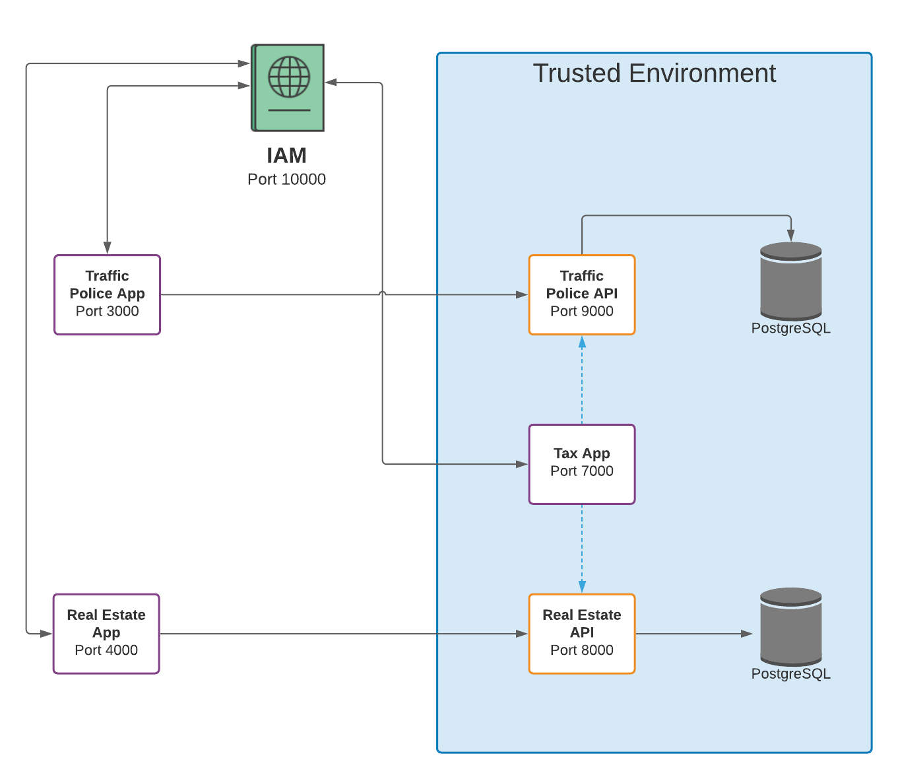

# Authorization Server Demo

This is an early look of what the future of authentication might look like for citizens and employees in Kurdistan.

**DISCLAIMER:** We are NOT using best practices in many places in an effort to put something together as quickly as possible. This is only meant as a demo.

## Components



### IAM

We are using IdentityServer 4 to implement our Authorization Server (Identity and Access Management). You can find [the source code here](./CSharp/AuthorizationServer).

**URL:** http://localhost:10000

**Dependencies:**

- [.NET Core 3.1 SDK](https://dotnet.microsoft.com/download/dotnet-core/3.1) (Because the latest version that IdentityServer4 supports is .NET Core 3.1)

**How to run:**

```
cd ./CSharp/AuthorizationServer
dotnet run
```

### Traffic Police App

This is a react SPA that allows citizens to manage their registered vehicles. It talks to the Traffic Police API to get and update data. You can find [the source code here](./React/traffic-police).

**URL:** http://localhost:3000

**Dependencies:**

- Authorization Server
- Traffic Police API
- [oidc-js](https://github.com/IdentityModel/oidc-client-js)
- NodeJS

**How to run:**

```
cd ./React/traffic-police/
npm install
npm start
```

### Traffic Police API

This is an ASP.NET Core API that talks to a PostgreSQL database. You can find [the source code here](./CSharp/TrafficPoliceApi).

**URL:** http://localhost:9000

**Dependencies:**

- [.NET 5 SDK](https://dotnet.microsoft.com/download/dotnet/5.0)
- Authorization Server
- PostgreSQL
- [.NET Core EF CLI](https://docs.microsoft.com/en-us/ef/core/cli/dotnet)
- [Microsoft.AspNetCore.Authentication.JwtBearer](https://www.nuget.org/packages/Microsoft.AspNetCore.Authentication.JwtBearer)

**How to run:**

```
cd ./CSharp/TrafficPoliceApi
dotnet tool install --global dotnet-ef
dotnet ef database update
dotnet run
```

### Real Estate App

This is a react SPA that allows citizens to manage their registered real estate. It talks to the Real Estate API to get and update data. You can find [the source code here](./React/real-estate).

**URL:** http://localhost:4000

**Dependencies:**

- NodeJS
- [oidc-js](https://github.com/IdentityModel/oidc-client-js)
- Real Estate API
- Authorization Server

**How to run:**

```
cd ./React/real-estate/
npm install
npm start
```

### Real Estate API

This is an ExpressJS API that talks to a PostgreSQL database.

**URL:** http://localhost:8000

**Dependencies:**

- NodeJS
- [node-jwks-rsa](https://github.com/auth0/node-jwks-rsa/blob/master/examples/express-demo/README.md)
- Authorization Server
- PostgreSQL

**Generate database schema**:

Create a database called `real_estate` and run this script:

```
CREATE TABLE public.real_estate (
	id serial NOT NULL DEFAULT nextval('real_estate_id_seq'::regclass),
	area float8 NOT NULL,
	address varchar(256) NULL,
	citizen_upn varchar(100) NULL,
	CONSTRAINT real_estate_pkey PRIMARY KEY (id)
);
```

**How to run:**

```
cd ./Node/real-estate
npm install
node index.js
```

### Tax App

This is a server-side app using ASP.NET Core Razor Pages. It talks to the Traffic Police API and Real Estate API to calculate taxes. You can find [the source code here](./CSharp/TaxApp).

**URL:** http://localhost:7000

**Dependencies:**

- Authorization Server
- Traffic Police API
- Real Estate API
- [Microsoft.AspNetCore.Authentication.OpenIdConnect](https://www.nuget.org/packages/Microsoft.AspNetCore.Authentication.OpenIdConnect)

**How to run:**

```
cd ./CSharp/TaxApp
dotnet run
```

## Notes

1. The APIs assume that the PostgreSQL database instance is on localhost and the username is `postgres` and password is `root`. If it's different, then you have to configure the APIs [here](https://github.com/ditdevtools/AuthorizationServerDemos/blob/master/CSharp/TrafficPoliceApi/appsettings.Development.json) and [here](https://github.com/ditdevtools/AuthorizationServerDemos/blob/master/Node/real-estate/queries.js) with the correct credentials.
1. We are using different tech stacks for different apps/APIs in this demo to show that an authorization server is language-agnostic and can be used by different tech stacks and in different use cases.
1. Although OpenID Connect requires HTTPS, we are using HTTP everywhere because dealing with HTTPS is difficult and we don't want this kind of negativity in our lives.
